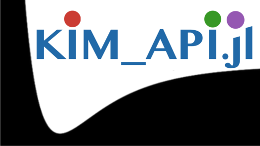

# KIM_API.jl



```@docs
KIM_API.KIM_API
```

## Overview

KIM_API.jl provides both low-level and high-level interfaces to KIM-API, enabling Julia users to access the extensive collection of validated interatomic models available through the OpenKIM framework. Main purpose of this package is to provide a convenient way to integrate KIM models into Julia based MD simulators. Think of this as the Julia equivalent of the KIMPY package but with additional wrappers for ease of use.

### Features

- **High-level functional interface** with `KIMModel()`
- **Automatic species mapping** and validation
- **Default support for multiple unit systems** (metal, real, SI, CGS, atomic)
- **Memory-safe wrappers** around KIM-API C functions
- **Comprehensive error handling** and validation

### Quick Start

```julia

using KIM_API, StaticArrays, LinearAlgebra

# Create model function
model = KIM_API.KIMModel("SW_StillingerWeber_1985_Si__MO_405512056662_006")

# Define system
species = ["Si", "Si"]
positions = [
    SVector(0.    , 0.    , 0.    ),
    SVector(1.3575, 1.3575, 1.3575),
]
cell = Matrix([[0.0 2.715 2.715] 
               [2.715 0.0 2.715] 
               [2.715 2.715 0.0]])
pbc = [true, true, true]

# Compute properties
results = model(species, positions, cell, pbc)
println("Energy: ", results[:energy])
println("Forces: ", results[:forces])
```

## Installation

### Prerequisites

You must have the KIM-API C++ library installed on your system. Visit [openkim.org](https://openkim.org) for detailed installation instructions.

Easiest way to install the KIM-API is Conda:

```bash
conda create -n kim-api kim-api=2.4 -c conda-forge
conda activate kim-api
export KIM_API_LIB=${CONDA_PREFIX}/lib/libkim-api.so
```

### Package Installation

FOr latest version:

```julia
using Pkg
Pkg.add(url="https://github.com/ipcamit/KIM_API.jl.git")
```

or

```julia
using Pkg
Pkg.add("KIM_API")
```
### Environment Setup

If KIM-API is not in your system library path, set the environment variable:

```bash
export KIM_API_LIB="/path/to/libkim-api.so"
```

## Supported Unit Systems

KIM_API.jl supports multiple unit systems commonly used in molecular dynamics:

| System     | Length   | Energy     | Charge | Temperature | Time |
|------------|----------|------------|--------|-------------|------|
| `:metal`   | Ångström | eV         | e      | K           | ps   |
| `:real`    | Ångström | kcal/mol   | e      | K           | fs   |
| `:si`      | meter    | Joule      | C      | K           | s    |
| `:cgs`     | cm       | erg        | statC  | K           | s    |
| `:electron`| Bohr     | Hartree    | e      | K           | fs   |

You can also specify custom units by passing a named tuple of units during model creation:

```julia
custom_units = (length=KIM_API.A, energy=KIM_API.eV, time=KIM_API.fs, charge=KIM_API.e, temperature=KIM_API.K)
model_custom = KIM_API.KIMModel("SW_StillingerWeber_1985_Si__MO_405512056662_006",
                                 units=custom_units)
```

## KIM Model Access

Visit [openkim.org](https://openkim.org) to browse the complete model database.

## Architecture

The package is organized into several modules:

- **`libkim.jl`**: KIM-API library loading and initialization
- **`constants.jl`**: KIM-API constants, enumerations, and unit systems
- **`model.jl`**: Low-level model creation and management
- **`species.jl`**: Species handling and validation
- **`neighborlist.jl`**: Neighbor list generation and callbacks
- **`highlevel.jl`**: High-level user interface

## Performance

KIM_API.jl is designed for high performance:

- Pre-computed species mappings minimize lookup overhead
- Efficient neighbor list generation using NeighbourLists.jl
- Zero-copy data passing to KIM-API where possible
- Minimal Julia-C FFI overhead
- Automatic memory management prevents leaks


## Citation

Consider citing the original KIM-API paper:
```
@article{tadmor2011potential,
  title={The potential of atomistic simulations and the knowledgebase of interatomic models},
  author={Tadmor, Ellad B and Elliott, Ryan S and Sethna, James P and Miller, Ronald E and Becker, Chandler A},
  journal={Jom},
  volume={63},
  number={7},
  pages={17},
  year={2011},
  publisher={Springer Nature BV}
}
```

## License

KIM_API.jl is released under the MIT License. See the LICENSE file for details.

## Acknowledgments

- The [OpenKIM](https://openkim.org) project for providing the KIM-API framework
- The Julia community for excellent packages like StaticArrays.jl and NeighbourLists.jl
- Contributors to the KIM model database
